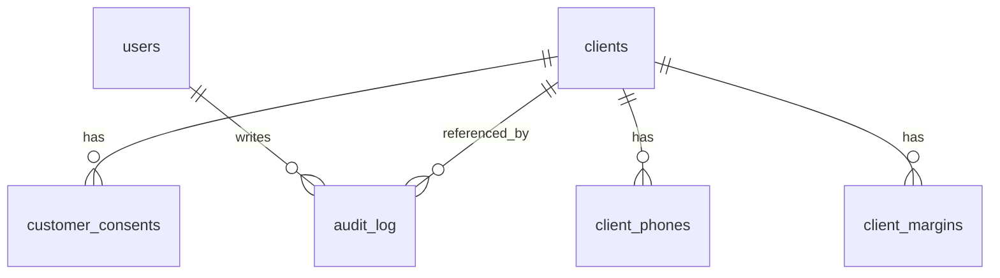

# Modelo de Dados — CRM Reliance

## Banco

O projeto usa SQLite via `sql.js`, persistido em arquivo/volume local. O schema principal ainda vive em `backend/src/db.js`.

## Novas Tabelas

### `customer_consents`

Registra opt-in/opt-out por cliente e canal.

- `id`
- `customer_id`
- `channel`
- `consent_status`
- `source`
- `ip_address`
- `user_agent`
- `consent_text_version`
- `created_at`
- `updated_at`
- `revoked_at`

### `audit_log`

Registra acoes criticas com metadados sanitizados.

- `id`
- `actor_user_id`
- `action`
- `entity_type`
- `entity_id`
- `metadata_json`
- `ip_address`
- `created_at`

## Campos Sensiveis

Campos sensiveis incluem CPF, telefone, email, endereco, data de nascimento, filiacao, matricula, dados bancarios, margem e payloads brutos de consulta.

## Protecoes Atuais

- `clients.cpf_hash`, `clients.phone_hash` e `clients.email_hash` permitem busca/indexacao sem depender apenas do valor puro.
- `backend/src/dataProtection.js` centraliza hash, criptografia AES-256-GCM, mascaramento e sanitizacao de auditoria.
- Audit logs devem receber apenas metadados sanitizados.

## Limite Atual

Ha dados legados em texto puro por compatibilidade com o CRM atual. A migracao completa para campos criptografados deve ser feita em etapa propria, com backup, script de migracao e validacao de leitura/escrita.

